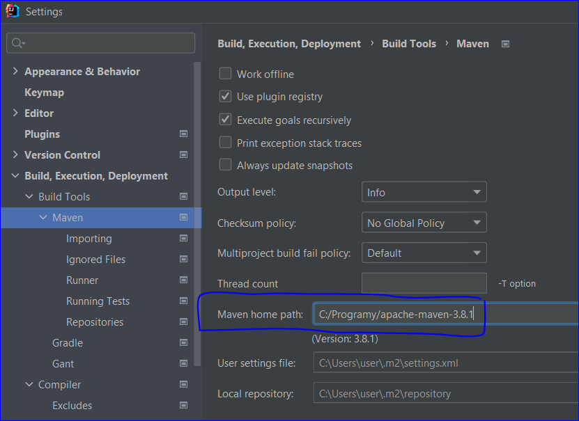

# PDFprinter

1. npm install
2. odpowiedni link do mavena w zakładce 

3. mvn clean package
4. w pomie zakomentowac 
<"scope">provided</"scope">
w dependency <artifactId>spring-boot-starter-tomcat</artifactId>
